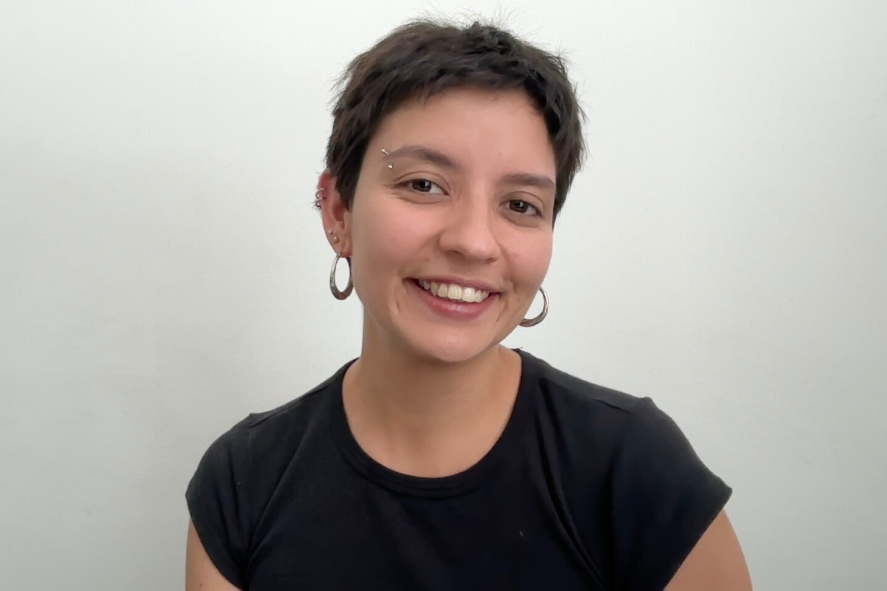

<!DOCTYPE html>
<html lang="en">
<head>
  <meta charset="UTF-8" />
  <meta name="viewport" content="width=device-width, initial-scale=1.0"/>
  <title>Antonia Fuentes’s webpage</title>
  <link href="https://fonts.googleapis.com/css2?family=Source+Sans+3:wght@300;400;500;600&family=STIX+Two+Text:ital,wght@0,400;0,500;0,600;1,400&display=swap" rel="stylesheet">
  
</head>
<body>

  <header>
    
Antonia Fuentes’s webpage

    <nav>
      <a class="active" onclick="showPage('home', this)" data-en="Home" data-fr="Accueil" data-es="Inicio">Home</a>
      <a onclick="showPage('research', this)" data-en="Research" data-fr="Recherche" data-es="Investigación">Research</a>
      <a onclick="showPage('teaching', this)" data-en="Teaching" data-fr="Enseignement" data-es="Docencia">Teaching</a>
      

        <button class="lang-btn active" onclick="setLang('en', this)">EN</button>
        <button class="lang-btn" onclick="setLang('fr', this)">FR</button>
        <button class="lang-btn" onclick="setLang('es', this)">ES</button>
      

    </nav>
  </header>

  <!-- HOME PAGE -->
  

    

      

        

          
        

        

          <h3 data-en="Contact" data-fr="Contact" data-es="Contacto">Contact</h3>

          

            <svg xmlns="http://www.w3.org/2000/svg" width="14" height="14" fill="none" viewBox="0 0 24 24" stroke="currentColor" stroke-width="2">
              <path stroke-linecap="round" stroke-linejoin="round" d="M21.75 6.75v10.5a2.25 2.25 0 0 1-2.25 2.25h-15a2.25 2.25 0 0 1-2.25-2.25V6.75m19.5 0A2.25 2.25 0 0 0 19.5 4.5h-15a2.25 2.25 0 0 0-2.25 2.25m19.5 0v.243a2.25 2.25 0 0 1-1.07 1.916l-7.5 4.615a2.25 2.25 0 0 1-2.36 0L3.32 8.91a2.25 2.25 0 0 1-1.07-1.916V6.75"/>
            </svg>
            antonia.fuentes [at] upf.edu</a>
          

          

            <svg xmlns="http://www.w3.org/2000/svg" width="14" height="14" fill="none" viewBox="0 0 24 24" stroke="currentColor" stroke-width="2">
              <path stroke-linecap="round" stroke-linejoin="round" d="M12 21v-8.25M15.75 21v-8.25M8.25 21v-8.25M3 9l9-6 9 6m-1.5 12V10.332A48.36 48.36 0 0 0 12 9.75c-2.551 0-5.056.2-7.5.582V21M3 21h18M12 6.75h.008v.008H12V6.75Z"/>
            </svg>
            Universitat Pompeu Fabra
          

          

            <svg xmlns="http://www.w3.org/2000/svg" width="14" height="14" fill="none" viewBox="0 0 24 24" stroke="currentColor" stroke-width="2">
              <path stroke-linecap="round" stroke-linejoin="round" d="M15 10.5a3 3 0 1 1-6 0 3 3 0 0 1 6 0Z"/>
              <path stroke-linecap="round" stroke-linejoin="round" d="M19.5 10.5c0 7.142-7.5 11.25-7.5 11.25S4.5 17.642 4.5 10.5a7.5 7.5 0 1 1 15 0Z"/>
            </svg>
            Campus de la Ciutadella   08005 Barcelona, Spain
          

        

      

      

        <h1 class="name" data-en="Antonia Fuentes" data-fr="Antonia Fuentes" data-es="Antonia Fuentes">Antonia Fuentes</h1>
        
PhD Candidate · Social Sciences

        

        

            I am a PhD student in the Department of Political and Social Sciences at Universitat Pompeu Fabra, under the supervision of Alba Lanau Sánchez, since 2024.
        

      

    

  

  <!-- RESEARCH PAGE -->
  

    

      

        <h2 data-en="Research" data-fr="Recherche" data-es="Investigación">Research</h2>
      

      <!-- Research Interests -->
      

        <h3>
          1 — Interests
        </h3>
        

            My research interests center on migration and family dynamics, with a particular focus on care and motherhood. My PhD project revolves around Latin American migrant mothers in Barcelona, their access to childare services, and the care strategies they adopt.
        

      

      <!-- Publications -->
      

        <h3>
          2 — Publications
        </h3>
        

          

            
Health system barriers to hypertension care in Peru: Rapid assessment to inform organizational-level change

            
(Joint with K. N. Williams et al.), PLOS Global Public Health, 2024

            

              <a href="https://journals.plos.org/globalpublichealth/article?id=10.1371/journal.pgph.0002404" target="_blank" class="pub-link" data-en="Link" data-fr="Lien" data-es="Enlace">Link</a>
            

          

        

      

      <!-- Talks -->
      

        <h3>
          3 — Talks
        </h3>
        

          

            
August 2026

            

              
[Title]

              
17th ESA Conference - Warsaw

              

                <a href="" target="_blank" class="pub-link" data-en="Slides" data-fr="Slides" data-es="Diapositivas">Slides</a>
              

            

          

        

      

    

  

  <!-- TEACHING PAGE -->
  

    

      

        <h2 data-en="Teaching" data-fr="Enseignement" data-es="Docencia">Teaching</h2>
      

      <!-- Current courses -->
      

        <h3>
          1 — Current courses
        </h3>
        

        

      

      <!-- Past courses -->
      

        <h3>
          2 — Past courses
        </h3>
        

        

      

    

  

  
</body>
</html>
